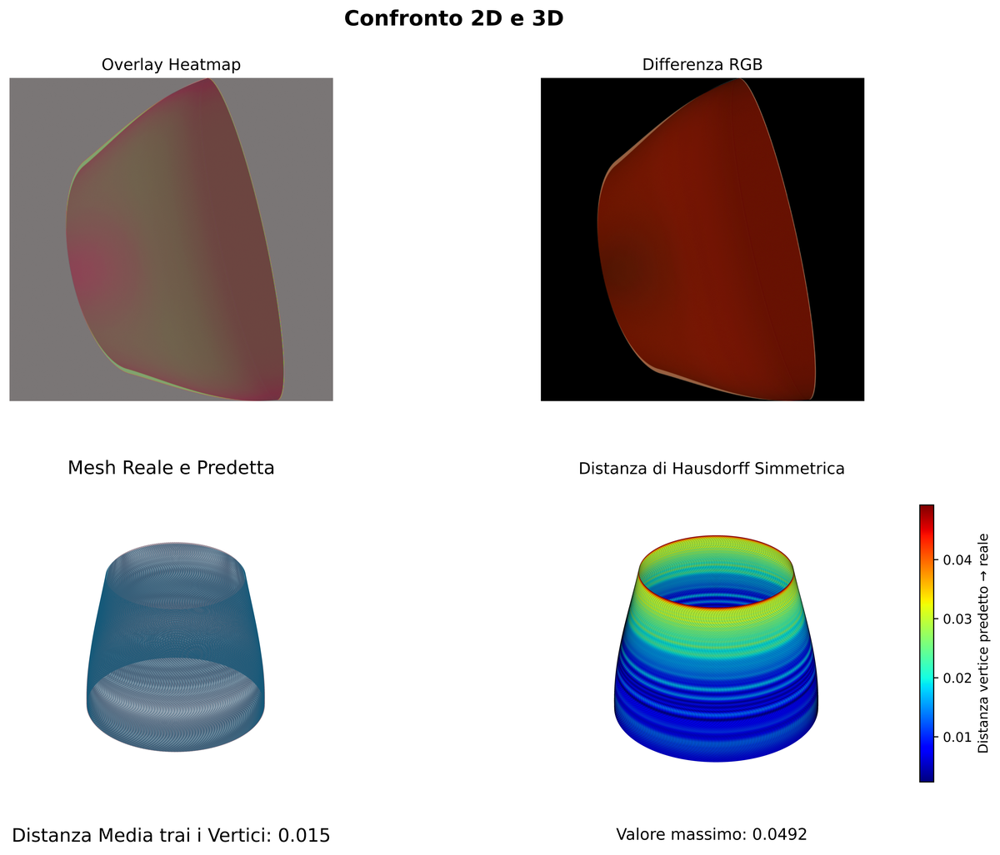

# Parametric reconstruction of 3D object with KAN
[](https://doi.org/10.5281/zenodo.15819213)


This repository contains the code for training and evaluating a hybrid neural network (pretrained CNN backbone + KAN network) for the parametric reconstruction of complex 3D objects from single images, using regression.
The initial goal was to assess whether KANs can be effectively used in this context, and subsequently to experimentally evaluate whether their symbolic regression-oriented nature provides efficiency and advantages compared to traditional networks, while aiming to maintain comparable conditions.

## Table of Contents

- [Parametric Reconstruction](#parametric-reconstruction)
- [Neural Network](#neural-network)
- [Results](#results)
- [Installation](#installation)
- [Usage](#usage)
- [Acknowledgments](#acknowledgments)

## Parametric Reconstruction

Parametric reconstruction of 3D models consists in representing the shape of an object using a finite set of parameters, which define its geometry. This approach requires only a small amount of data (`.json files`) and allows the user to locally modify individual values without having to manipulate the entire mesh.

The first step involved creating a dataset in Blender using a parametric formula, introducing shape and color variations to derive the 6 representative parameters. All detailed information about the dataset can be found in its `readme.txt` file, available in the [dataset installation instructions section](#installation).


## Neural Network

Since some tests conducted with CNN-KAN networks were not satisfactory (in line with the numerous results observable in the dedicated section of the repository [awesome-kan](https://github.com/mintisan/awesome-kan?tab=readme-ov-file#convkans)), the adopted strategy was to take the best from current technologies, namely a pretrained backbone for extracting image features:

* `EfficientNet-B0`: used as a large and stable network to verify the actual effectiveness of using KANs as final fully connected layers for regression;
* `SqueezeNet`: used in the later comparison between KAN and MLP networks, as being very lightweight and having few parameters allowed for a more direct comparison in terms of generalization capability, requiring the network to "reconstruct" the underlying formula in order to correctly predict the parameters.

Among the various KAN libraries tested, the most effective for this purpose were:
* `EfficientKan` by [Blealtan and Akaash Dash](https://github.com/Blealtan/efficient-kan);
* `FourierKan` by [Fan Yijia](https://github.com/kolmogorovArnoldFourierNetwork/KAF).


## Results 

Model evaluation, in addition to training and validation loss curves, was conducted using metrics such as [MAE](https://scikit-learn.org/stable/modules/generated/sklearn.metrics.mean_absolute_error.html), [RMSE](https://scikit-learn.org/stable/modules/generated/sklearn.metrics.root_mean_squared_error.html) and [R2](https://scikit-learn.org/stable/modules/generated/sklearn.metrics.r2_score.html), calculated through the `calcola_metriche`function.
Visual comparisons were then performed using the methods `visualizza_pred_reale`, for direct comparisons between input image and real/predicted mesh, and `visualizza_metriche_immagini` for a more in-depth analysis such as overlaying the real and predicted mesh and, most importantly, visualizing the [Hausdorff distance](https://en.wikipedia.org/wiki/Hausdorff_distance).


For example, the best prediction of the second-best model `EFFNETB0_UNLOCK_DROP_EFFK_6` yielded the following results:

The comparison between the worst predictions of the two top-performing models instead revealed that the best one is `EFFNETB0_UNLOCK_DROP_FOURIER_6`:

||||
|:-:|:-:|:-:|
|Real Mesh|Fourier_6|EfficientKan_6|

With the following predicted parameters:


Even more interesting is the final comparison between the best-performing model `EFFNETB0_UNLOCK_DROP_FOURIER_6` and the two models used to evaluate the performance difference between KAN and MLP layers `SQUEEZENET_DROP4_CLASSICA_DROP_256` and `SQUEEZENET_DROP4_FOURIER_DROP_256`, sover three randomly selected test set images. Only the networks equipped with KAN layers showed superior performance in approximation, in particular the last image poses an interesting question as to what to reward when working with neural networks, the pure observation of metrics (like the neural network `EFFNETB0_UNLOCK_DROP_EFFK_6`) or going beyond what has been learnt and generalising as best as possible, as the truncated cone-shaped point in the picture was never encountered during training and only `EFFNETB0_UNLOCK_DROP_FOURIER_6` ha  attempted, mistakenly, to approximate it.


## Installation

Clone the repository and install the dependencies using pip:

```bash
git clone https://github.com/antoniogrs/kan_parametric_reconstruction.git
cd kan_parametric_reconstruction
pip install -r requirements.txt
```

The dataset must be downloaded separately from Zenodo at the following link. After extracting the `.rar` file, place the `dataset` folder directly in the root of the project directory.

- 📦 Dataset: [Download from Zenodo](https://doi.org/10.5281/zenodo.15819213)

### Specification
* Python 3.13.2
* PyTorch 2.8.0, 
* Cuda  12.9
* Blender 4.4

## Usage

The script  `main.py` allows you to either train new networks or evaluate them both through metrics and visually.
Before evaluating, the network must be trained by uncommenting the following block of code:
```python 
# 2) Results visualization # It’s essential to run the render in Blender first to have the image name! 

img_data = IMG_MAP.get(nome) if img_data is None: print(f"❌ Nessuna immagine associata a {nome}, salto.") continue visualizza_confronti_immagini(classe_modello , img_data["best_image"], img_data["worst_image"]) 
```
and keeping this one active:
```python 
# 1) Training and metrics calculation
print(f"\n\n--- INIZIO TRAINING: {nome} ---\n\n")
esegui_training_con_modello(classe_modello)

print(f"\n\n--- INIZIO TESTING: {nome} ---\n\n")
esegui_test(classe_modello)
```

Only after training the model with the chosen hyperparameters and rendering the predicted object (best and worst) in Blender, it is possible to comment out the first block and uncomment the second one to visualize the results. Make sure to properly update the `MODELLI_DA_TESTARE` list and the `IMG_MAP` dictionary.
The training progress can be monitored using `tensorboardX` , while the training curves of multiple models can be plotted by uncommenting the following block:
```python
risultati_modificato_path =os.path.join(BASE_DIR, 'results', 'CilindroSpiralato')
percorso_log = [f"{risultati_modificato_path}/{MODELLI_DA_TESTARE[0]}_CilindroSpiralato/loss_log.json",
                f"{risultati_modificato_path}/{MODELLI_DA_TESTARE[1]}_CilindroSpiralato/loss_log.json",
                f"{risultati_modificato_path}/{MODELLI_DA_TESTARE[2]}_CilindroSpiralato/loss_log.json",
                f"{risultati_modificato_path}/{MODELLI_DA_TESTARE[3]}_CilindroSpiralato/loss_log.json"]
plot_modelli(MODELLI_DA_TESTARE, percorso_log)
sys.exit()
```

## Acknowledgments
I would like to thank my advisor Prof. Ugo Erra and Dr. Gilda Manfredi for their support during the development of this project, all the authors mentioned above for creating and developing the libraries used and the contributors of [awesome-kan](https://github.com/mintisan/awesome-kan) for providing for providing inspiration and useful tools. Finally the author of [KAN](https://github.com/KindXiaoming/pykan) for initiating a new and exciting line of research in this field.
